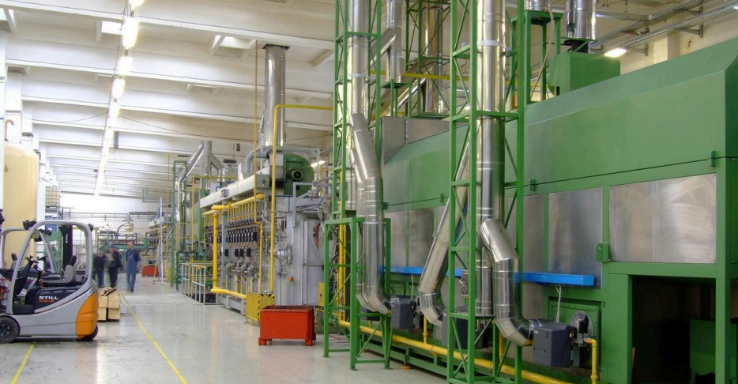

# Projeto de Manutenção Preditiva – Bootcamp CDIA

## Contexto

Em ambientes industriais ocorrem com frequência falhas inesperadas em máquinas, as quais podem geram custos elevados e perda de produtividade, devido ao tempo de máquina parada para manutenção corretiva.  
A proposta deste projeto é desenvolver um sistema de **manutenção preditiva**, capaz de prever diferentes tipos de falha em máquinas industriais a partir de dados de sensores coletados por dispositivos IoT.  

<p align="center">
  
</p>  

O problema foi analisado a partir de três modelagens:  

### Binária
- **Objetivo:** prever se haverá falha de tensão excessiva (FTE);  
- **Modelos utilizados:** Regressão Logística, Random Forest e XGBoost;  
- **Métrica principal:** F1-score da classe positiva.  

### Multirrótulo
- **Objetivo:** prever simultaneamente diferentes falhas (FDF, FDC, FP, FTE, FA);  
- **Modelos utilizados:** Random Forest, XGBoost e MLP;  
- **Métrica principal:** F1 micro;  
- **Métricas adicionais:** F1 macro, Hamming Loss, Subset Accuracy.  

### Multiclasse
- **Objetivo:** prever apenas um tipo de falha por vez;  
- **Modelos utilizados:** Regressão Logística, Random Forest e XGBoost;  
- **Métrica principal:** F1 Macro;  
- **Métricas adicionais:** Acurácia e Balanced Accuracy.  

---

## Comparação de Modelos

Cada script de treinamento gera um arquivo `.json` com:  
- Métricas de todos os modelos testados;  
- Indicação do melhor modelo treinado.  

Esses arquivos são consumidos pela interface criada com Streamlit para gerar comparações gráficas.

---

## Visualização com Streamlit

A interface permite alternar entre as modelagens em abas separadas:  
- **Binária:**: resultados da FTE;  
- **Multirrótulo:** métricas, gráficos e exportação para API;  
- **Multiclasse:** comparação de falhas exclusivas.  

---

## API com FastAPI

Endpoints:  
- `POST /predict/multilabel`: gera CSV no formato exigido pela avaliação oficial;  
- `POST /predict/binary_fte`: predição binária com *threshold*;
- `POST /predict/multiclass`: predição multiclasse.  

---

## Como Executar

### Instalar dependências
```bash
pip install -r requirements.txt
```

### Treinar os modelos
```bash
python modelagem_binaria/treinamento_binario.py
python modelagem_multirrotulo/treinamento_multirrotulo.py
python modelagem_multiclasse/treinamento_multiclasse.py
```

### Rodar a API
```bash
uvicorn api.preditor_fastapi:app --reload --host 127.0.0.1 --port 8000
```

### Rodar o Streamlit
```bash
streamlit run visualizacoes/app.py
```

---

## Conclusão

O sistema aborda uma solução de **manutenção preditiva** de máquinas industriais, incluindo:  
- Modelos de Machine Learning;  
- Interface interativa em **Streamlit**;  
- Integração com **FastAPI**.
